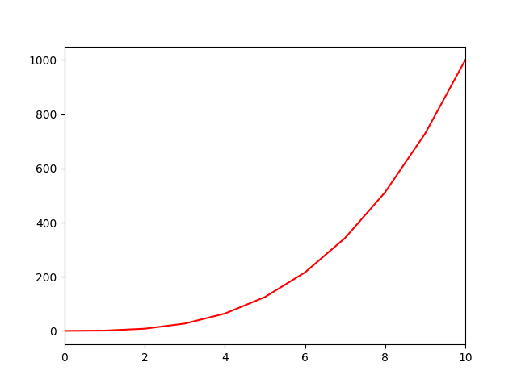

# 0x01. Plotting

## Concepts Learned

- What is a plot?
- What is a scatter plot? line graph? bar graph? histogram?
- What is matplotlib?
- How to plot data with matplotlib
- How to label a plot
- How to scale an axis
- How to plot multiple sets of data at the same time

## 0-line.py

Creates and show the next plot graphic:

